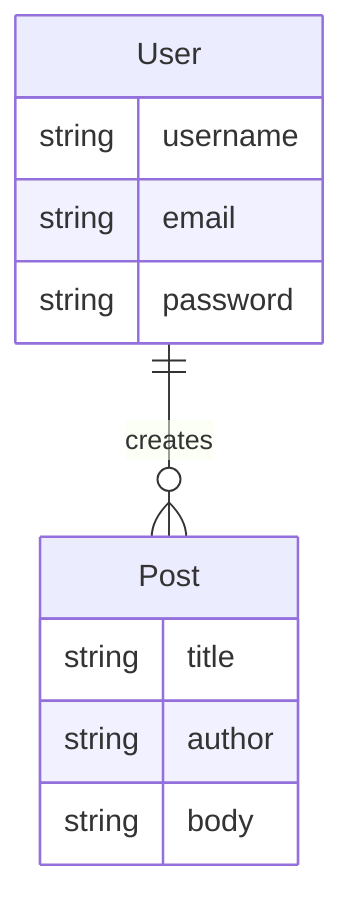

# Dummy Blog

A simple blog web-app, built with Django.

## ERD

## About

Dummy Blog is a web-app for users to pour their thoughts in a simple manner. It supports basic authentication and multiple users.

## Built With

